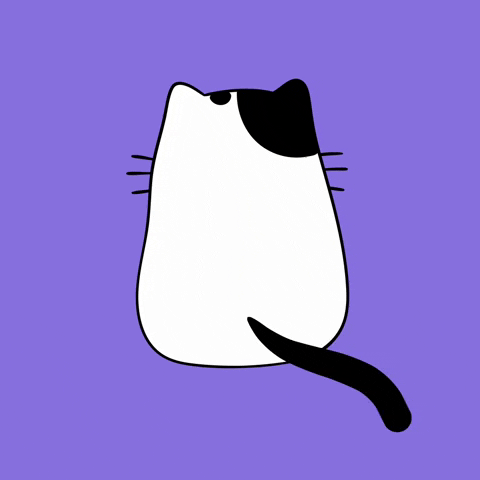

# Purrfect Personalities: 
*A data analysis project designed to find relationships between where and how a pet cat was acquired and its temperament*

The roughly 6.5 billion cat pictures on the internet and tens of millions of cat videos on YouTube, and all of us who are totally here for that content, cannot be wrong:

Cats are...something else.


As much as we love to see them and watch them, many shelter and rescue cats go un-adopted; according to the National Kitten Coalition, approximately 1.4 million shelter cats are euthanized each year. 

This project idea came from wondering how cat data might help more cats escape that ending and find loving furr-ever homes. 

Also from being the owner of a ginger cat and wondering if it's true that all ginger cats just share the one brain cell...

## Essential Questions

1. Does a cat's acquisition history have any relationship to the cat's adult personality and temperament? For example, does a rescue cat have a different pattern of traits and behaviors than a cat purchased from a breeder? Do cat cafe cats behave differently than pet store cats?

2. Does a cat's coat color have any identifiable commonalities to a cat's behavior or personality? For example, are black cats bad news and bad luck? Are orange tabbies as un-smart as the memes and reels suggest? Do tortoiseshells have "tortitude?" 

3. Could this data in the hands of rescue and shelter personnel help match cats to their forever homes based on what a family might be looking for in a companion animal?

## Gathering the Data

The data used in this project came from these resources:

1. [Cat Owner Survey](https://forms.gle/78h9wVkpMtL4VAsk6) 

2. Boone County Animal Control Center adoption data for 2022, Excel file

3. [HumanePro Pets by the Numbers](https://humanepro.org/page/pets-by-the-numbers)

The cat owner survey was developed by me and distributed via social media, a contact at a local cat cafe, and through family and friend contacts. The resulting Google Sheet was exported as a CSV file.

The BCACC adoption data came to me as a spreadsheet prepared by a contact at a local animal shelter. The director who compiled this report for me made sure to include the cat's coat color and filtered it for just cats. 

I scraped the HumanePro Pets by the Numbers page to access their survey data for "Where Do People Acquire Pets?" 

## How to Run the Project

The project was created as a Jupyter Notebook in a base Conda environment in Visual Studio Code. The project file, ```purrfect_purrsonalities.ipynb```, can be run with these steps:

### If you're a data person...

This project only uses the pandas, numpy, matplotlib, and Seaborn libraries. If you're a "data person," you can clone this repo and open ```purrfect_purrsonalities.ipynb``` in your IDE of choice. If you already have pandas, numpy, matplotlib, and Seaborn installed because you used them for your own project, simply open and run the file. If you have Anaconda installed, use your base Conda environment. 

### If you want to create a virtual environment from the requirements.txt file...

A ```requirements.txt``` file is included in this repo and can be used with pip to create a virtual environment with the specific versions of the packages I used. 

First, create a virtual environment with these terminal commands at the directory where you cloned the repo.

Linux/macOS:

`python3 -m venv venv` 

Windows: 

`python -m venv venv`

Now activate the virtual environment.

Linux//macOS:

`source venv/bin/activate`

Windows:

`venv\Scripts\activate`

Then install the packages listed in the requirements.txt file:

`pip install -r requirements.txt`

To leave this virtual environment after you've examined the project run:

`deactivate`

### And if you're a ride-or-die Conda user and want to run the project file in a Conda environment...

There's an environment.yml file in the repo. You know what to do. If not, see above and use those directions. 

## Code Kentucky DA2 Project Requirements

1. Load Data

I read in one CSV file, one Excel file, and scraped one table from the web. 

2. Clean and Operate Data While Combining

The first three sections of ```purrfect_purrsonalities.ipynb``` show cleaning and wrangling for the three data sources used. The data is combined using pandas merges and concatenation throughout the remaining sections of the project.

3. Visualize/Present Data

A total of four matplotlib or Seaborn visualizations are employed in parts four, five, and six of the project Notebook. There are also multiple pivot tables throughout the project.

4. Best Practices

A Conda base virtual environment was used for coding this project; while not best practice in and of itself, care was taken at the end to create a requirements.txt file that ONLY lists imported packages for this specific ipynb file, and instructions are given for opening this file in a virtual environment if necessary. 

5. Interpretation of Data

I made extensive use of markdown cells to explain my processes and findings at every step. 


## The End



### Key Findings

Cats adopted from cat cafes, shelters/rescues, and purchased from pet stores ranked higher in socialness than cats found as strays, cats born from other cats in the home, and cats purchsed from breeders. There's something to be said for the socialization a cat gets when it is exposed to lots of people and people-noise and touch for a part of its life. 

Some valid behavior and trait patterns do seem to be linked to a cat's coat color. Orange cats were ranked lower on intelligence; gray cats were ranked lower on activity level; tuxedo cats and solid black cats ranked moderately high on socialness, activity, and intelligence, making them well-rounded and well-dressed cats; seal points ranked high on intelligence and vocalization; and both calicos and torties ranked low on socialness and seem to be "shy." But how much of this is how their owners see them BECAUSE of the stereotypes and preconceived notions they make about their cats based on appearance? More work could be done here to help guide future cat parents.

Or...we could all just walk into a rescue or shelter and wait for a cat to choose us. 


